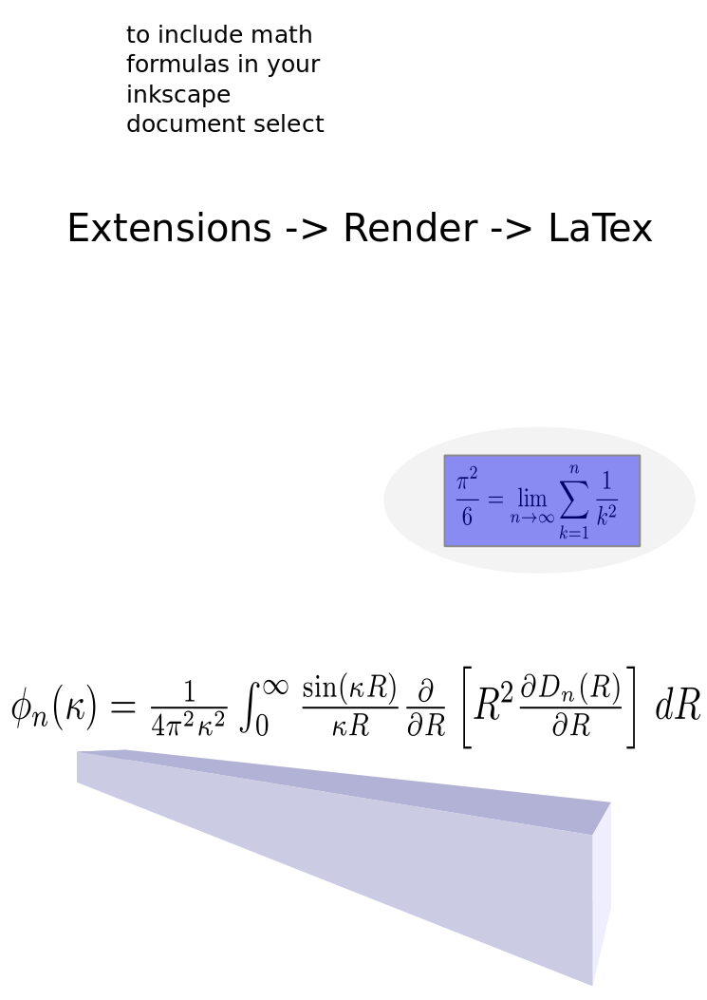

# Quick Start

Since latex in inkscape is broken in ubuntu 18.04 I built this container. 
Unfortunately, it has become quite large as I didn't take the time to build it with alpine.

## How to use

checkout the git repo. Inside, run

~~~
xhost +

docker run --rm \
  -e DISPLAY \
  --name inkscape \
  -v $(pwd):/home/inkscape/workspace \
  -v /tmp/.X11-unix:/tmp/.X11-unix \
  -v $HOME/.fonts:/home/inkscape/.fonts \
  ludwigprager/inkscape:1

~~~

The file with-latex.svg will generate this result:

